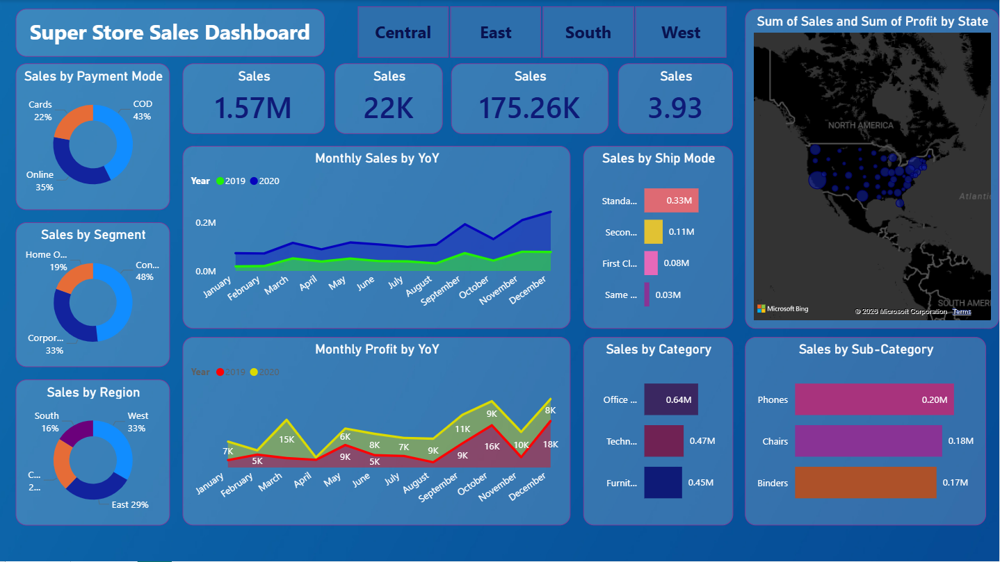
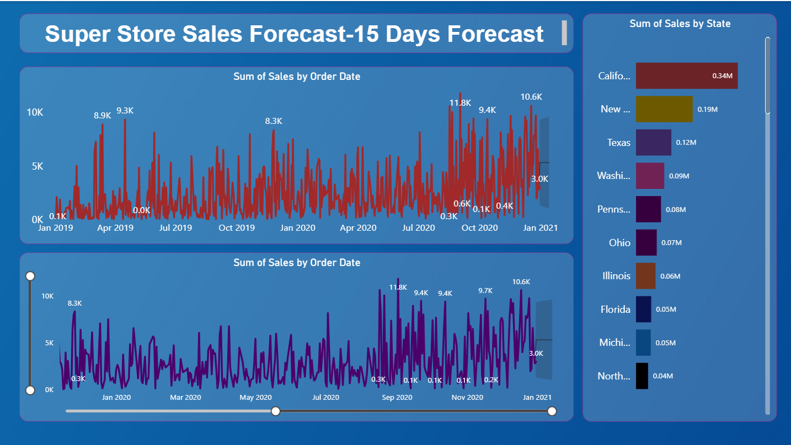

# Super Store Sales Dashboard | Power BI

A Power BI dashboard built to analyze sales and profit performance across customers, products, regions, states, payment methods, and shipping modes.

The project also includes a separate page for daily sales analysis and a 15-day sales forecast.

## Dashboard Preview

### Sales Dashboard



### Sales Forecast Dashboard



## Project Overview

This project uses Power BI to turn Super Store sales data into an interactive dashboard.

The main dashboard covers:

* Sales by payment mode
* Sales by customer segment
* Sales by region
* Monthly sales by year
* Monthly profit by year
* Sales by shipping mode
* Sales by category
* Sales by sub-category
* State-level sales and profit

The second page focuses on daily sales trends and a short-term 15-day forecast.

## Dashboard Pages

### 1. Sales Dashboard

The first page provides an overall view of sales performance.

It includes KPI cards for sales along with charts for customers, products, regions, payment methods, shipping methods, and monthly performance.

The map provides a state-level view of sales and profit.

### 2. Sales Forecast

The second page focuses on sales over time.

It shows daily order-date sales and includes a 15-day forecast to give a short-term view of expected sales.

A state-wise sales chart is also included for comparison.

## Key Business Questions

The dashboard can be used to answer questions such as:

* How are sales performing over time?
* Which customer segment contributes the most sales?
* Which region has the highest sales contribution?
* Which states generate more sales?
* Which product categories perform better?
* Which sub-categories have higher sales?
* What payment methods are commonly used?
* Which shipping modes contribute to sales?
* How does profit change throughout the year?
* What does the short-term sales forecast indicate?

## Tools Used

* **Power BI Desktop** — Dashboard and report development
* **Power Query** — Data preparation and transformation
* **DAX** — Measures and calculations
* **Bing Maps** — Geographic visualization

## Data Preparation

The dataset was prepared in Power Query before creating the dashboard.

The preparation process included:

* Checking and correcting data types
* Working with date fields
* Preparing columns for analysis
* Transforming the data into a suitable reporting format

DAX measures were used for calculations required by the dashboard.

## Analysis

The dashboard allows sales performance to be viewed from different perspectives.

### Customer Analysis

Sales are compared across:

* Consumer
* Corporate
* Home Office

### Regional Analysis

The report compares:

* Central
* East
* South
* West

### Product Analysis

Sales are analyzed across product categories and sub-categories to identify areas with higher sales contribution.

### Operational Analysis

Payment modes and shipping modes are included to understand how orders are distributed across different methods.

### Time Analysis

Monthly and daily sales trends are used to understand changes in performance over time.

### Geographic Analysis

The map provides a state-level view of sales and profit.

## Forecast

The second dashboard page includes a 15-day sales forecast based on the available order-date sales data.

The forecast is intended for short-term analytical reference and should not be considered a guaranteed prediction of future sales.

## Project Structure

```text
Super-Store-Sales-PowerBI/
│
├── README.md
├── Super_Store_Sales_Dashboard.pbix
│
├── Data/
│   └── dataset.csv
│
└── Screenshots/
    ├── Final_Dashbord.png
    └── Final_Dashbord_1.png
```

Update the file names above if the actual files in the repository have different names.

## How to Open

1. Install Power BI Desktop.
2. Clone or download this repository.
3. Open the `.pbix` file.
4. If Power BI asks for the dataset location, select the dataset from the project folder.
5. Refresh the report if required.

## Skills Demonstrated

This project demonstrates practical experience with:

* Power BI
* Power Query
* DAX
* Data Cleaning
* Data Transformation
* Data Visualization
* KPI Reporting
* Sales Analysis
* Profit Analysis
* Time-Series Analysis
* Geographic Analysis
* Business Intelligence
* Basic Sales Forecasting

## Author

**Jai Shriram Tiwari**

B.Tech — Computer Science & Engineering

**Areas of Interest:** Data Analytics, Business Analysis, Power BI, SQL, Excel and Business Intelligence.

## Project Type

**Power BI | Sales Analytics | Business Intelligence | Forecasting**
